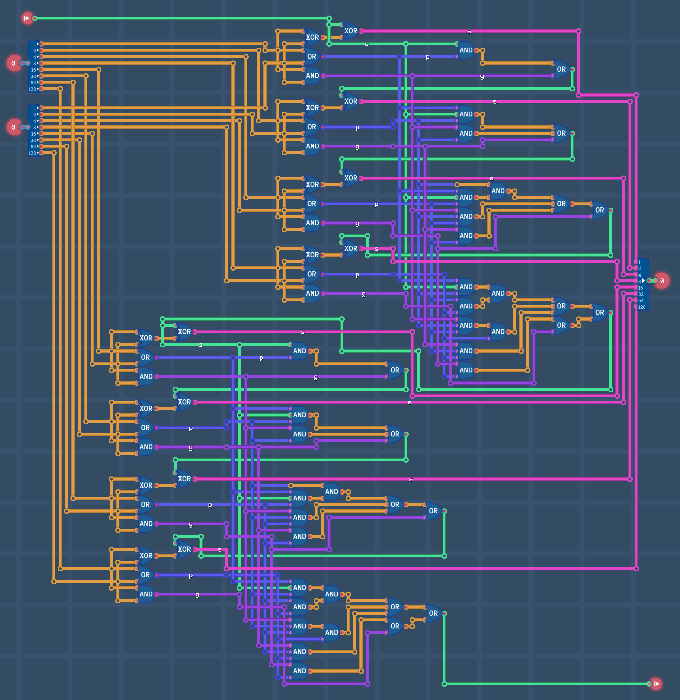

# 8-bit Carry-Lookahead Adder



This repository contains the Verilog file for an 8-bit [Carry-Lookahead Adder (CLA)](https://en.wikipedia.org/wiki/Carry-lookahead_adder) created using the game [Turing Complete](https://turingcomplete.game/). This design was created for educational purposes and demonstrates a basic CLA implementation.

## Features

- Low delay 8-bit Carry-Lookahead Adder using 4-bit lookahead circuits
- Designed using the game Turing Complete
- Straightforward and easy-to-understand schematic with 
- Suitable for learning purposes

## Getting Started

### Turing Complete

You can copy the schematic by searching "8BitCLA" in Schematic Hub.

### Verilog

1. Clone this repository:

```sh
git clone https://github.com/SoloSynth1/8BitCLA.git
```

Open the `_8BitCLA.v` file in your preferred Verilog editor.
Review and modify the code as needed.
Use the Verilog simulator of your choice to test the adder functionality.

## Additional Notes

- This is a simple implementation and may not be optimized for performance or area.
- More advanced CLA designs exist with different levels of complexity.
- Feel free to contribute improvements or modifications to this code.

## Credits

This CLA implementation refers to the one provided from *Introduction to Logic Circuits & Logic Design with VHDL (2nd ed., 2019)* by Brock J. LaMeres.

## License

This work is released under the GNU General Public License v3.0. Refer to [LICENSE](LICENSE) file for more information.
